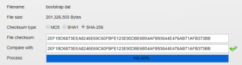

# zeon_bootstrap_file 
This repository contains the bootstrap chain files for the Zeon blockchain. 
Using these files helps shorten the amount of time it takes to sync the wallet 
since you don't need to sync the blockchain from scratch.

---

## Instructions
If you have never ran the Zeon wallet, follow the first set of directions below. 
If you have already ran the Zeon wallet before, follow the second set of directions below.

#### If you have *never* ran the Zeon wallet:

1. Download the [latest bootstrap files](https://github.com/Pubfred/zeon_bootstrap_file/releases/tag/v1.4).
1. Find the downloaded *bootstrap.dat* file .
1. Move the *bootstrap.dat* file to your OS's respective data directory.

	1. For Windows: `C:\Users\[YourUsername]\AppData\Roaming\ZEON`
		1. Or paste `%appdata%\Roaming\ZEON` into the file explorer path field
	1. For MacOS: `~/Library/Application Support/ZEON`   
	1. For Linux: `~/.zeon/`
	
	             1. In ubuntu you can do a wget :
		     
		     ~/.zeon# wget https://github.com/Pubfred/zeon_bootstrap_file/releases/download/v1.4/bootstrap.dat
		
		
1. Download the [latest Zeon wallet](https://github.com/Pubfred/Zeon_hex/releases/tag/v2.1.3.1).
1. Install and run the wallet. Syncing should begin at the bootstrap's last block.

#### If you have *already* ran the Zeon wallet:

1. Download the [latest bootstrap files](https://github.com/Pubfred/zeon_bootstrap_file/releases/tag/v1.4).
1. Find the downloaded *bootstrap.dat* file .
1. Close and quit the Zeon wallet if it is running.
1. Navigate to your OS's respective data directory.

	1. For Windows: `C:\Users\[YourUsername]\AppData\Roaming\ZEON\`
		1. Or paste `%appdata%\Roaming\ZEON\` into the file explorer path field
	1. For MacOS: `~/Library/Application Support/ZEON/`
	1. For Linux: `~/.zeon/`
	
	             1. In ubuntu you can do a wget :
		     
		     ~/.zeon# wget https://github.com/Pubfred/zeon_bootstrap_file/releases/download/v1.4/bootstrap.dat
		
1. Remove all files and folders **EXCEPT** for *wallet.dat*, *zeon.conf*, *masternode.conf*, and the `backups/` folder.
   Again, **DO NOT** delete the *wallet.dat* file as it contains the private keys for your funds. 
   Deleting this file will result in loss of funds.
1. Move bootstrap.dat file into the Zeon wallet's data directory that you just removed files from.
1. If you do not have the [latest Zeon wallet](https://github.com/Pubfred/Zeon_hex/releases/tag/v2.1.3.1), download and install it.
1. Run the wallet and syncing should begin at the bootstrap's last block.

  
